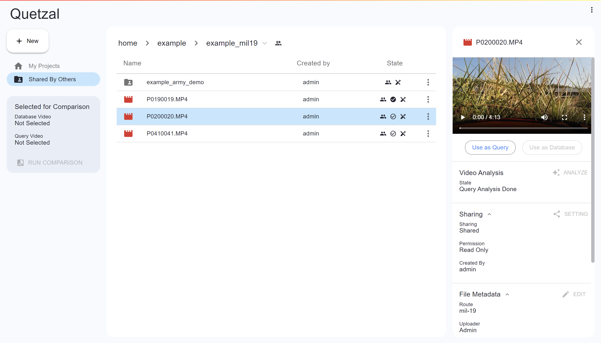
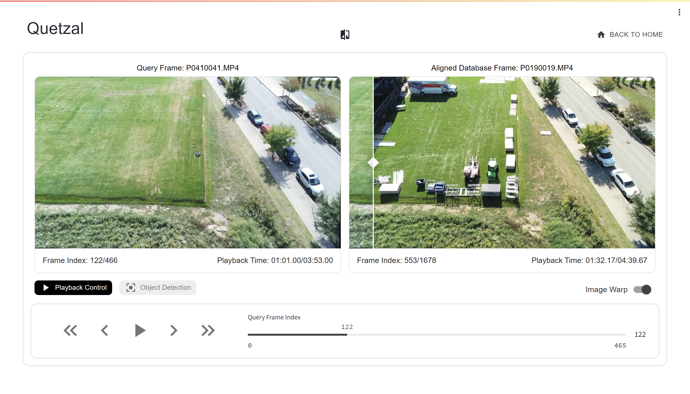
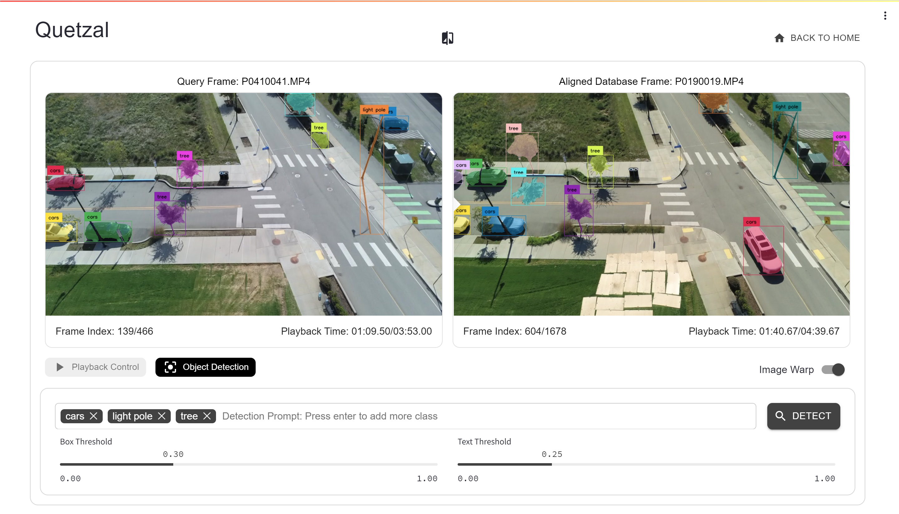

# Quetzal: An Interactive System for Drone Video Frame Alignment & Detection of Salient Changes

Quetzal provides automatic frame alignment between two drone footages taken along similar routes.

Quetzal offers automated frame alignment for drone footage captured along similar routes. The Quetzal app features a file-system GUI designed for organizing and sharing various projects and videos, enabling users to compare two videos from the database. Additionally, it incorporates zero-shot object detection ([GroundingSAM](https://github.com/IDEA-Research/Grounded-Segment-Anything)), allowing users to search for objects within video frames based on text prompts provided.


**File-explorer view**



**Video Comparison View**



**Object Detection View**




**Future Plans:** Support change detection between two drone footages.

## License

Unless otherwise stated, all source code and documentation are under the [GPL-2.0]. A copy of this license is included in the [LICENSE](LICENSE) file.

Parts of this repository include modified content from third-party sources. Files located in `external/` are copyrighted by their respective authors under the licenses listed below. Additional third-party contents are noted in the source files and in the following list:

| Project | Modified | License |
| --- | --- | --- |
| [AnyLoc/AnyLoc](https://github.com/AnyLoc/AnyLoc) | Yes | BSD-3-Clause license |
| [pollen-robotics/dtw](https://github.com/pollen-robotics/dtw/blob/master/dtw/dtw.py) | Yes | GPL-3.0 license |
| [IDEA-Research/Grounded-Segment-Anything](https://github.com/IDEA-Research/Grounded-Segment-Anything) | No | Apache-2.0 license |
| [bouzidanas/streamlit-float](https://github.com/bouzidanas/streamlit-float) | No | MIT license |


## Support
Currently, Quetzal has been tested exclusively on Ubuntu 20.04.6 LTS with Nivida GPU (Tesla T4)

## Setting up the Environment

Download Anaconda/Miniconda to your system. If you already have Anaconda, we recommend updating Conda to the latest version:

```bash
conda activate base
conda update -n base -c defaults conda
```

Clone the repository:

```bash
git clone https://github.com/cmusatyalab/quetzal.git
cd quetzal
```

Set up the Conda environment:

```bash
conda create -n quetzal python=3.11
conda activate quetzal
bash ./setup_conda.sh
```
IMPORTANT!! if you have cuda installed in your custom path, edit line 7 of [setup_conda.sh](https://github.com/cmusatyalab/quetzal/blob/main/setup_conda.sh)

```bash
export CUDA_HOME=/path/to/cuda
```

## Generate Documentation
run ./mkdocs.sh on root dir

## Running the Web Server with GUI

### GPU Server:

To run the Quetzal app on a GPU server, use the following command:

```bash
python3 -m quetzal_app -l "127.0.0.1" -p PORT_NUM --dataset-root /data/root --metadata-root /meta_data/root --cuda --cuda-device 0 -u USER_NAME
```

RUN THIS IN quetzal_dev directory
```bash
python3 -m quetzal_app -p 7861 --dataset ../data_test/home/root --metadata-root ../data_test/meta_data/root --cuda -u example
```

### CPU Only:

For systems without a GPU, execute the following command:

```bash
python3 -m quetzal_app -l "127.0.0.1" -p PORT_NUM --dataset-root /data/root --metadata-root /meta_data/root -u USER_NAME
```

The default user is "default_user".

## Configuring the Data Folder
Quetzal provides a CLI for setting up the dataset directory. You can use the following commands to initialize the directory, add a user, or import/convert an existing directory to create a Quetzal-compatible meta-dataset directory.

### Initialize Dataset and Meta-dataset Directories
To initialize the dataset folder at "/data/root" and meta-dataset at "/meta_data/root":

```bash
python3 -m quetzal init -d /data/root -m /meta_data/root
```

### Add a User Directory for the Dataset
To add a user directory for the dataset at "/data/root":

```bash
python3 -m quetzal user -d /data/root -m /meta_data/root -u USER_NAME
```

### Import Dataset and Create Meta-dataset
To import a dataset from "/data/root" and create a meta-dataset at "/meta_data/root":

```bash
python3 -m quetzal import -d /data/root -m /meta_data/root
```

The default root dataset directory is "./data/home/root," and the default meta-dataset directory is "./data/meta_data/root."

### Directory Structure Overview
Your dataset and meta-dataset directories will be structured as follows:

```
root_datasets_dir/
├── user_name1/
│   ├── project_name1/
│   │   ├── video_name1.mp4
│   │   ├── video_name2.mp4
│   │   ├── ...
│   │   ├── subproject_name/
│   │   │   ├── video_name1.mp4
│   │   │   └── ...
│   │   └── ...
│   └── project_name2/
├── user_name2/
└── ...

metadata_directory/
├── user_name1.info.txt
├── user_name1.meta.txt
├── user_name1/
│   ├── project_name1.info.txt
│   ├── project_name1.meta.txt
│   ├── project_name1/
│   │   ├── video_name1.mp4.info.txt
│   │   ├── video_name1.mp4.meta.txt
│   │   ├── video_name2.mp4.info.txt
│   │   ├── video_name2.mp4.meta.txt
│   │   ├── ...
│   │   ├── database/
│   │   │   ├── video_name1/
│   │   │   │   ├── frames_{fps}_{resolution}/
│   │   │   │   │   ├── frame_%05d.jpg
│   │   │   │   │   └── ...
│   │   │   │   └── ...
│   │   │   └── video_name2/
│   │   │       ├── frames_{fps}_{resolution}/
│   │   │       │   ├── frame_%05d.jpg
│   │   │       │   └── ...
│   │   │       └── ...
│   │   ├── query/
│   │   │   ├── video_name2/
│   │   │   │   ├── frames_{fps}_{resolution}/
│   │   │   │   │   ├── frame_%05d.jpg
│   │   │   │   │   └── ...
│   │   │   │   └── ...
│   │   │   └── ...
│   │   ├── subproject_name.info.txt
│   │   ├── subproject_name.meta.txt
│   │   ├── subproject_name/
│   │   │   ├── video_name1.mp4.info.txt
│   │   │   ├── video_name1.mp4.meta.txt
│   │   │   └── ...
│   │   └── ...
│   └── project_name2/
├── user_name2.info.txt
├── user_name2.meta.txt
└── ...
```

This structure ensures organized storage and easy access to your projects, videos, and associated metadata.
## How to use GUI
The File-system GUI of Quetzal mirrors the user-friendly design found in many popular cloud service interfaces. By clicking on a file or directory, you can access detailed information about it. The three-dot menu offers additional options for modifying the file or directory.

To enter a directory you've previously selected, simply click on it again. To navigate back or to a different parent directory, use the breadcrumb navigation at the top.

For video files, the information section includes an "Analyze" option. This feature allows you to register the video for comparison. Once analyzed, you have the choice to mark the video as a "Use as Query" or "Use as Database" for comparison purposes. After selecting one video for each category, proceed by clicking "RUN COMPARISON" on the left side of the screen to move to the comparison page

The comparison page showcases the frame from the query video on the left and the aligned frame from the database video on the right, arranged side by side. Additionally, for the image on the right, a slider is provided, enabling you to overlay and compare the two frames directly.

To delve into zero-shot object detection on the current frame, click on the "object-detection" tab.

## Developing Extensions
To ensure backend algorithms are compatible with Quetzal_app, modifications to files/directories should utilize `quetzal.dtos.dtos.QuetzalFile` and `quetzal.dtos.video.Video` objects. For guidance on generating cached/meta data associated with specific files, please refer to the modules `quetzal.engines.vpr_engine.anyloc_engine` and `quetzal.engines.image_registration_engine.loftr_engine`. These references will provide insights into how and where to manage cached/meta data effectively.


To expand the selection of Object Detection models, please refere to the `quetzal.engines.detection_engine.grounding_sam_engine` and its implementation within `quetzal_app.page.video_comparison_controller`. To integrate your custom object detection model, follow the structure of the abstract class defined in `quetzal.engines.engine`. Then, register your model by adding it to the `detector_dict` within `quetzal_app.page.video_comparison_controller`.
