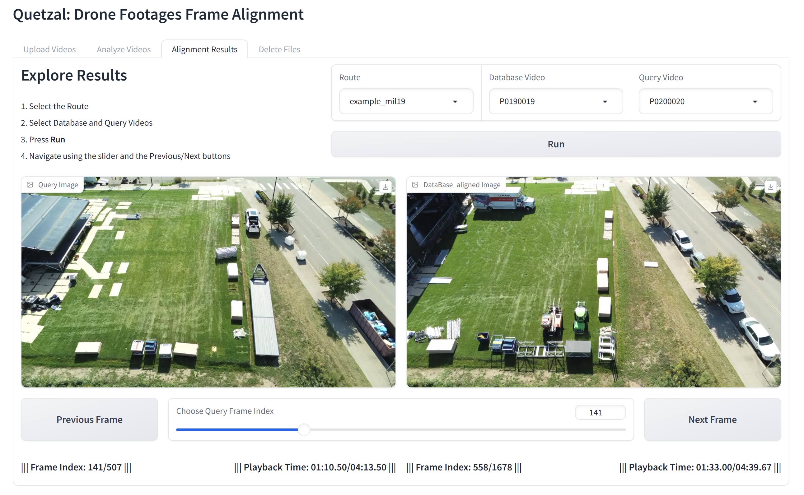

# Quetzal: Drone Footage Frame Alignment

Quetzal provides automatic frame alignment between two drone footages taken along similar routes.



**Future Plans:** Support for tunable salient change detection between two drone footages.

## License

Unless otherwise stated, all source code and documentation are under the [GPL-2.0]. A copy of this license is included in the [LICENSE](LICENSE) file.

Parts of this repository include modified content from third-party sources. Files located in `external/` are copyrighted by their respective authors under the licenses listed below. Additional third-party contents are noted in the source files and in the following list:

| Project | Modified | License |
| --- | --- | --- |
| [AnyLoc/AnyLoc](https://github.com/AnyLoc/AnyLoc) | Yes | BSD-3-Clause license |
| [pollen-robotics/dtw](https://github.com/pollen-robotics/dtw/blob/master/dtw/dtw.py) | Yes | GPL-3.0 license |

## Setting up the Environment

Download Anaconda/Miniconda to your system. If you already have Anaconda, we recommend updating Conda to the latest version:

```bash
conda activate base
conda update -n base -c defaults conda
```

Clone the repository:

```bash
git clone https://github.com/cmusatyalab/quetzal.git
cd quetzal
```

Set up the Conda environment:

```bash
conda create -n quetzal python=3.8
conda activate quetzal
bash ./setup_conda.sh
```

## Running the Web Server with GUI

**GPU Server:**

```bash
python3 -m src.quetzal_frame_alignment --cuda --cuda_device 0
```

**CPU Only:**

```bash
python3 -m src.quetzal_frame_alignment
```

**Setting custom Server Name and Port Number**
```bash
export GRADIO_SERVER_NAME="127.0.0.1"
export GRADIO_SERVER_PORT="7860"
```

## Setting up Data Folder and Pre-analyzing Your Videos

The default root dataset folder is "../data". The structure should look like the following:

```
root_datasets_dir/
|
├── route_name/
|   ├── raw_video/
|   |   ├── video_name.mp4
|   |   └── ...
|   |
|   ├── database/
|   |   ├── video_name/
|   |   |   ├── frames_{fps}_{resolution}/
|   |   |   |   ├── frame_%05d.jpg
|   |   |   |   └── ...
|   |   |   └── ...
|   |   └── ...
|   |
|   ├── query/
|   |   ├── video_name/
|   |   |   ├── frames_{fps}_{resolution}/
|   |   |   |   ├── frame_%05d.jpg
|   |   |   |   └── ...
|   |   |   └── ...
|   |   └── ...
|   └── ...
└── ...
```

To pre-upload and pre-analyze your videos, place your raw video files at `root_datasets_dir/route_name/raw_video/`. Then run the following:

**Analysis for Database Video:**

```bash
python3 -m src.compute_vlad --dataset-root "../data" --route-name "route_name" --database-video "video.mp4"
```

**Analysis for Query Video:**

```bash
python3 -m src.compute_vlad --dataset-root "../data" --route-name "route_name" --query-video "video.mp4"
```